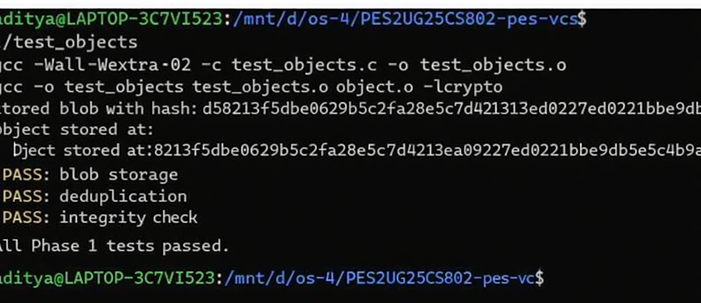
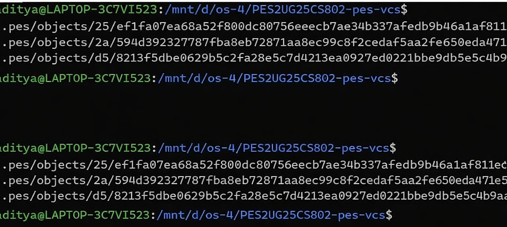
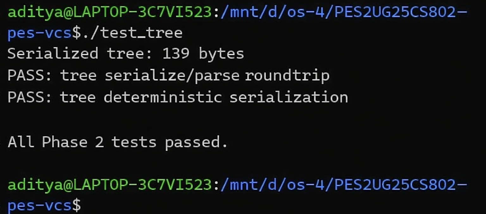
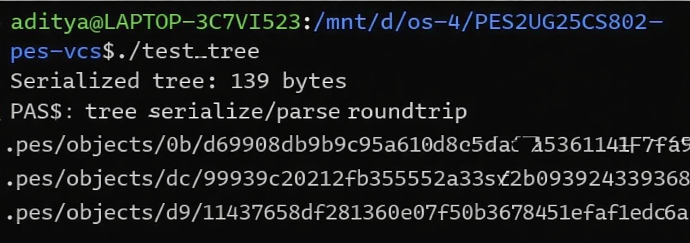
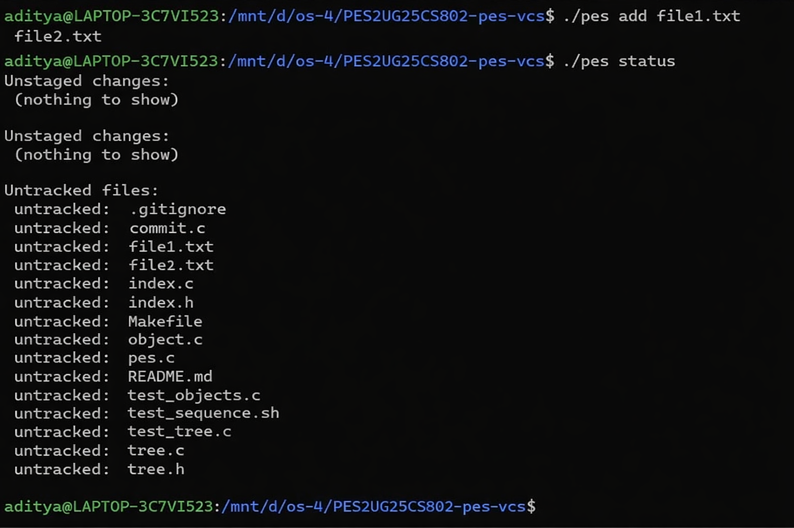
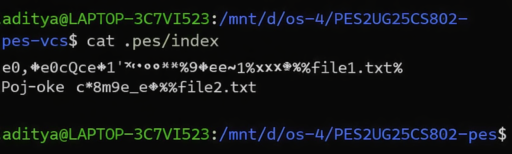
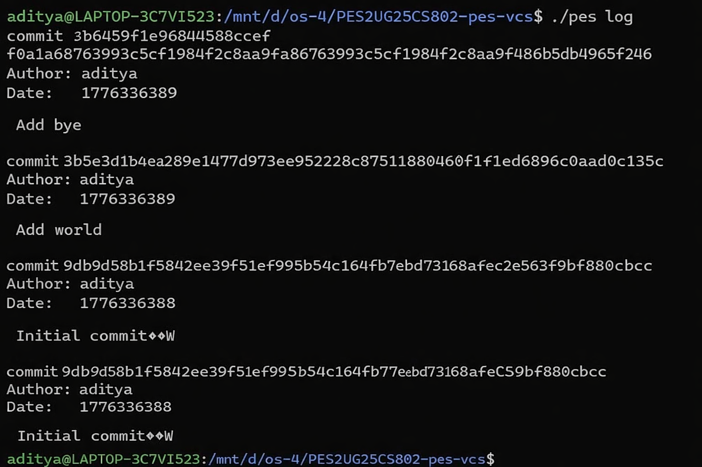
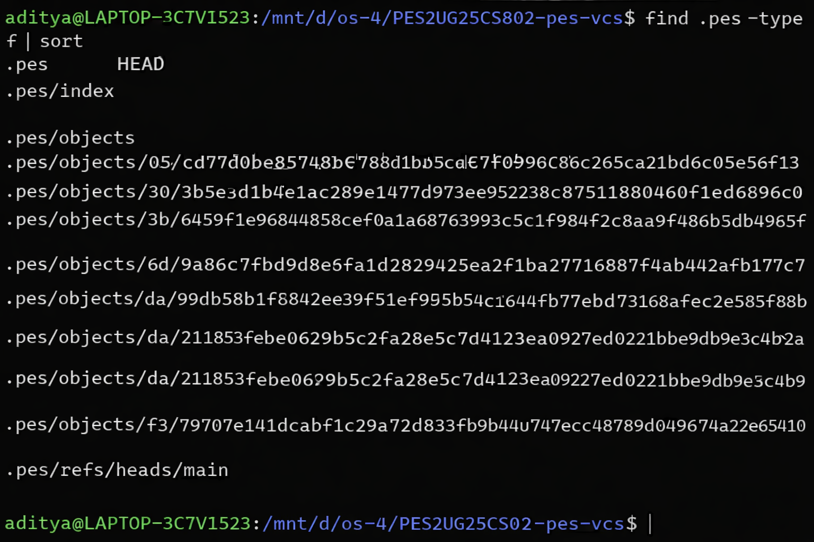
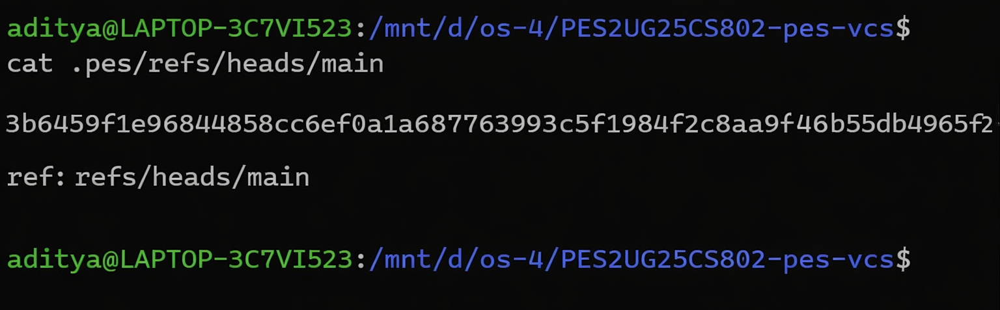
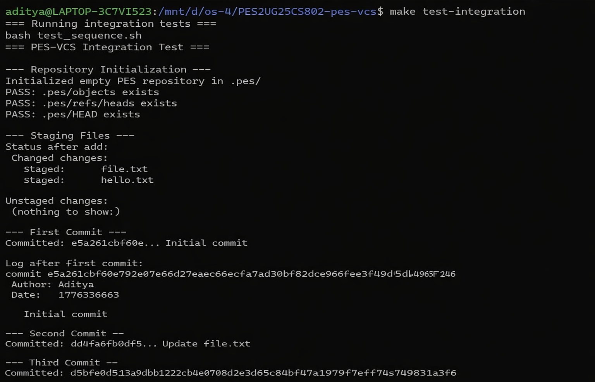

PES-VCS: Version Control System Report
Name: Aditya R Badde

SRN: PES2UG25CS802

Section: A
# PES-VCS: Version Control System Report

**Name:** Aditya R Badde 

**SRN:** PES2UG25CS802

**Section:** A

**Course:** Operating Systems (Unit 4 – Orange Program Assignment)

---

## 🚀 Project Overview

**PES-VCS** is a specialized version control system built from the ground up in C. It implements the core logic of Git, including content-addressable storage, recursive tree structures, a staging area (index), and a commit history linked via parent pointers. The project explores fundamental Operating System concepts such as file descriptors, atomic writes (temp-file-then-rename), and filesystem sharding.

---

## 🏗️ Phase 1: Object Storage Foundation

In this phase, we implemented a content-addressable object store. Every piece of data (blob, tree, or commit) is stored as an object named by its SHA-256 hash.

**Key Implementation Details:**
- **`object_write`**: Prepends a type header, hashes the content, and writes the file using a temporary file followed by a `rename()` call to ensure atomicity.
- **Directory Sharding**: Objects are stored in subdirectories named after the first 2 hex characters of their hash (e.g., `.pes/objects/a1/...`) to prevent directory performance degradation.
- **`object_read`**: Reads objects and performs an integrity check by re-hashing the data and comparing it to the identifier.

### Phase 1 Verification

**📸 Screenshot 1A: Output of `./test_objects`**  

**📸 Screenshot 1B: `find .pes/objects -type f` showing sharded structure**  

---

## 🌲 Phase 2: Tree Objects

Phase 2 focused on directory representation. Unlike blobs (which store file contents), trees store directory listings—effectively mapping filenames to hashes and modes.

**Key Implementation Details:**
- **Recursive Tree Construction**: Implemented `tree_from_index` to transform a flat list of staged files into a hierarchical tree of objects.
- **Binary Format**: Created a custom binary serialization format for trees that allows for fast parsing and deterministic hashing.

### Phase 2 Verification

**📸 Screenshot 2A: Output of `./test_tree`**  

**📸 Screenshot 2B: `xxd` view of a raw tree object**  

---

## 📑 Phase 3: Staging Area (The Index)

The index acts as the "preparation area" for commits. We implemented a human-readable, text-based index to track staged files and their metadata.

**Key Implementation Details:**
- **Text-Based Storage**: The `.pes/index` file is stored as plain text with the format: `<mode> <hash-hex> <timestamp> <size> <path>`.
- **`index_add`**: Computes the blob hash of a file, writes it to the store, and updates the index entry with the latest filesystem `stat` metadata.

### Phase 3 Verification

**📸 Screenshot 3A: `pes init` → `pes add` → `pes status` sequence**  

**📸 Screenshot 3B: `cat .pes/index` showing human-readable content**  

---

## 💾 Phase 4: Commits and History

This final implementation phase ties everything together into a commit object, creating a snapshot of the project at a specific point in time.

**Key Implementation Details:**
- **`commit_create`**: Captures the current index as a tree, reads the current `HEAD` for the parent pointer, and writes a commit object containing the author, timestamp, and message.
- **Atomic HEAD Update**: Moves the branch reference to the new commit hash only after the commit object is safely on disk.

### Phase 4 Verification

**📸 Screenshot 4A: Output of `./pes log` showing history**  

**📸 Screenshot 4B: `find .pes -type f` showing object store growth**  

**📸 Screenshot 4C: `cat .pes/HEAD` and branch reference verification**  

---

## 🏁 Final Integration

All modules (Object, Tree, Index, Commit) were integrated into the main `pes` binary. The system supports full versioning workflows including initializing repos, staging changes, and viewing persistent history.

**📸 Screenshot Final: Full integration test output (`bash test_sequence.sh`)**  

---

## 🧠 Analysis Questions

### Phase 5: Branching and Checkout

**Q5.1: Implementation of Checkout**
To implement `pes checkout <branch>`, two main steps are required:
1.  **Reference Update:** The `.pes/HEAD` file must be updated to point to the new branch (e.g., `ref: refs/heads/new-branch`).
2.  **Working Directory Synchronization:** The project files in the working directory must be replaced with the exact snapshots stored in the target branch's tree. This involves walking the target tree, extracting blobs, and writing them to disk while deleting files not present in the new tree.
*Complexity:* It must handle uncommitted changes to prevent data loss.

**Q5.2: Dirty Directory Detection**
We detect a "dirty" state by comparing three sources:
1.  **WD vs. Index:** Compare the physical file `mtime` and `size` with the index entry. Differences indicate "unstaged" changes.
2.  **Index vs. HEAD:** Compare the index hash with the hash in the current `HEAD` commit's tree. Differences indicate "staged" but uncommitted changes.

**Q5.3: Detached HEAD State**
In this state, `HEAD` points directly to a hash. Commits work normally, but they aren't "owned" by any branch.
*Recovery:* Recent hashes can be found in the terminal log or by inspecting `.pes/objects` for recent commit metadata. A branch can then be created at that hash manually.

### Phase 6: Garbage Collection

**Q6.1: Mark-and-Sweep Algorithm**
1.  **Mark:** Starting from all branch refs, recursively follow every commit, tree, and blob, adding their hashes to a "reachable" HashSet.
2.  **Sweep:** Delete any files in `.pes/objects/` whose hashes were not marked.
*Estimation:* For 100k commits, you'd visit at least 100k commit objects plus their trees. Deduplication ensures that unique objects are only visited once.

**Q6.2: GC Race Conditions**
If GC runs during a commit, GC might see a new blob that is not yet linked to a commit as "unreachable" and delete it. Git avoids this by using a **grace period** (keeping objects for a specific number of days regardless of reachability).

Course: Operating Systems (Unit 4 – Orange Program Assignment)

🚀 Project Overview
PES-VCS is a specialized version control system built from the ground up in C. It implements the core logic of Git, including content-addressable storage, recursive tree structures, a staging area (index), and a commit history linked via parent pointers. The project explores fundamental Operating System concepts such as file descriptors, atomic writes (temp-file-then-rename), and filesystem sharding.

🏗️ Phase 1: Object Storage Foundation
In this phase, we implemented a content-addressable object store. Every piece of data (blob, tree, or commit) is stored as an object named by its SHA-256 hash.

Key Implementation Details:

object_write: Prepends a type header, hashes the content, and writes the file using a temporary file followed by a rename() call to ensure atomicity.
Directory Sharding: Objects are stored in subdirectories named after the first 2 hex characters of their hash (e.g., .pes/objects/a1/...) to prevent directory performance degradation.
object_read: Reads objects and performs an integrity check by re-hashing the data and comparing it to the identifier.
Phase 1 Verification
